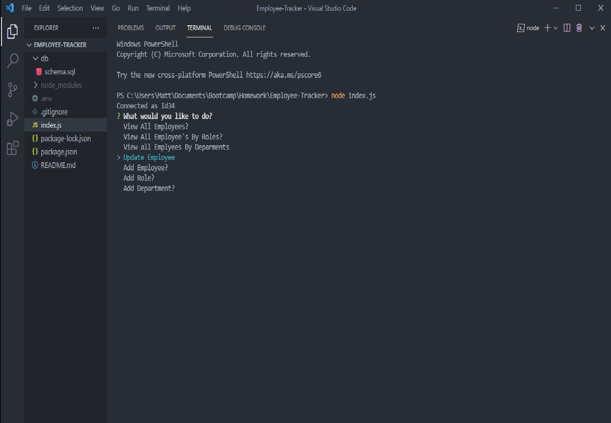

# Employee-Tracker

## Screenshot Of Project

## Video Of Project

## Description

A terminal based program that will ask a user various questions to do with a table of employees. Based on the users inputs they can add new employees, add new roles, add new departments, they can also view all of this data in table format. My motivation for this project was to better learn how to use sql and sequalizer

## Installation 

This project cannot be run on a webpage and must be used in the source code.

1: Download repo from github. 2: Save where desired. 3: Open file with a text editor of your choice.

## Usage

Before using ensure you have node installed. You may also need to install various different npms such as: inquirer, mysql, console.table, dotenv.

1: Open the schema.sql file in the db folder. 2: type "source schema.sql" in the mysql console to start the database then exit it. 3: Open the index.js file. 4: type "node index.js" in the terminal. 5: follow the prompts that are given to you in order to achieve your desired result.

## License 

MIT License

Copyright (c) [2021] [Matthew Walford]

Permission is hereby granted, free of charge, to any person obtaining a copy of this software and associated documentation files (the "Software"), to deal in the Software without restriction, including without limitation the rights to use, copy, modify, merge, publish, distribute, sublicense, and/or sell copies of the Software, and to permit persons to whom the Software is furnished to do so, subject to the following conditions:

The above copyright notice and this permission notice shall be included in all copies or substantial portions of the Software.

THE SOFTWARE IS PROVIDED "AS IS", WITHOUT WARRANTY OF ANY KIND, EXPRESS OR IMPLIED, INCLUDING BUT NOT LIMITED TO THE WARRANTIES OF MERCHANTABILITY, FITNESS FOR A PARTICULAR PURPOSE AND NONINFRINGEMENT. IN NO EVENT SHALL THE AUTHORS OR COPYRIGHT HOLDERS BE LIABLE FOR ANY CLAIM, DAMAGES OR OTHER LIABILITY, WHETHER IN AN ACTION OF CONTRACT, TORT OR OTHERWISE, ARISING FROM, OUT OF OR IN CONNECTION WITH THE SOFTWARE OR THE USE OR OTHER DEALINGS IN THE SOFTWARE.